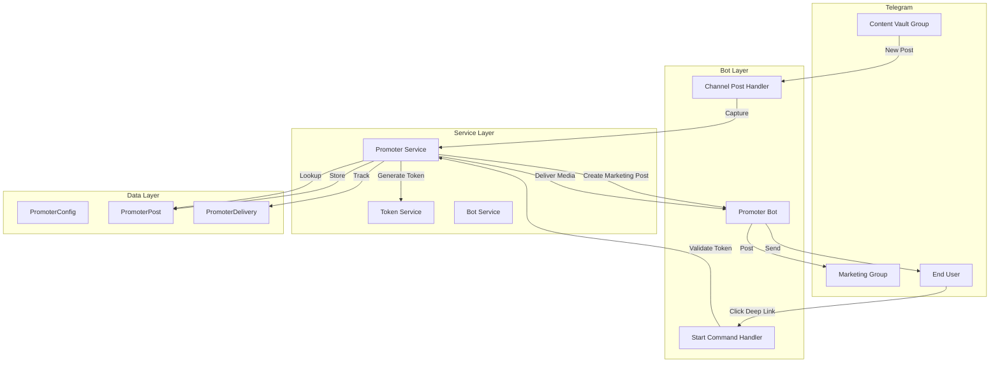

# Design Document: Promoter 2.0

## Overview

Promoter 2.0 is a content promotion and delivery system built on top of the existing Telegram bot management platform. The system enables a two-tier marketing funnel where content creators can:

1. Upload original media to a private Content Vault group
2. Automatically generate promotional posts with deep links in a public Marketing group
3. Deliver original content to end users who click the deep links

The design leverages the existing bot infrastructure, database models, and message handling patterns while introducing three new database tables and specialized handlers for the promoter workflow.

**Key Design Principles:**
- Reuse existing bot management and entity linking infrastructure
- Follow established patterns from ForwardRule and AutoDropRule features
- Ensure scalability to 1000+ posts per configuration
- Respect Telegram rate limits with built-in throttling
- Provide comprehensive analytics for campaign tracking

## Architecture

### System Components



### Integration Points

**Existing Infrastructure:**
- **Bot Model**: Reuse existing Bot table and bot management
- **TelegramEntity Model**: Reuse for Content Vault and Marketing groups
- **BotTelegramEntity**: Reuse for bot-group admin relationships
- **Channel Post Handler**: Extend to detect promoter configurations
- **Start Command Handler**: Extend to handle deep link tokens
- **Token Service**: Extend for promotion token generation

**New Components:**
- **PromoterConfig Table**: Configuration for promoter instances
- **PromoterPost Table**: Stored media posts with tokens
- **PromoterDelivery Table**: Delivery tracking and analytics
- **Promoter Service**: Business logic for capture, posting, and delivery

## Components and Interfaces

### Database Models

#### PromoterConfig

Stores configuration for each promoter instance (one per Content Vault group).

```typescript
model PromoterConfig {
  id                    String         @id @default(uuid())
  userId                String         @map("user_id")
  botId                 String         @map("bot_id")
  bot                   Bot            @relation(fields: [botId], references: [id], onDelete: Cascade)
  vaultEntityId         String         @map("vault_entity_id")
  vaultEntity           TelegramEntity @relation("PromoterVault", fields: [vaultEntityId], references: [id], onDelete: Cascade)
  marketingEntityId     String         @map("marketing_entity_id")
  marketingEntity       TelegramEntity @relation("PromoterMarketing", fields: [marketingEntityId], references: [id], onDelete: Cascade)
  
  name                  String         // User-friendly name
  isActive              Boolean        @default(true) @map("is_active")
  
  // CTA Configuration
  ctaTemplate           String         @default("🔥 Click here to get the content: {link}") @map("cta_template")
  autoPostToMarketing   Boolean        @default(true) @map("auto_post_to_marketing")
  
  // Token Configuration
  tokenExpirationEnabled Boolean       @default(false) @map("token_expiration_enabled")
  tokenExpirationDays   Int?           @map("token_expiration_days")
  
  // Error Messages
  invalidTokenMessage   String         @default("❌ This link is invalid or has been removed.") @map("invalid_token_message")
  expiredTokenMessage   String         @default("⏰ This link has expired.") @map("expired_token_message")
  
  // Stats
  totalCaptures         Int            @default(0) @map("total_captures")
  totalMarketingPosts   Int            @default(0) @map("total_marketing_posts")
  totalDeliveries       Int            @default(0) @map("total_deliveries")
  
  metadata              Json?
  createdAt             DateTime       @default(now()) @map("created_at") @db.Timestamptz(3)
  updatedAt             DateTime       @updatedAt @map("updated_at") @db.Timestamptz(3)
  deletedAt             DateTime?      @map("deleted_at") @db.Timestamptz(3)
  
  posts                 PromoterPost[]
  
  @@unique([botId, vaultEntityId])
  @@index([userId])
  @@index([botId])
  @@index([vaultEntityId])
  @@index([marketingEntityId])
  @@index([isActive])
  @@map("promoter_config")
}
```

#### PromoterPost

Stores captured media posts with their tokens and metadata.

```typescript
model PromoterPost {
  id                    String           @id @default(uuid())
  configId              String           @map("config_id")
  config                PromoterConfig   @relation(fields: [configId], references: [id], onDelete: Cascade)
  
  token                 String           @unique // Unique promotion token
  fileId                String           @map("file_id") // Telegram file_id
  mediaType             Int              @map("media_type") // 0=photo, 1=video, 2=document
  caption               String?          @db.Text
  
  // Source message info
  sourceMessageId       Int              @map("source_message_id")
  sourceChatId          String           @map("source_chat_id")
  
  // Marketing post info
  marketingMessageId    Int?             @map("marketing_message_id")
  marketingChatId       String?          @map("marketing_chat_id")
  marketingPostedAt     DateTime?        @map("marketing_posted_at") @db.Timestamptz(3)
  
  // Token status
  isExpired             Boolean          @default(false) @map("is_expired")
  expiresAt             DateTime?        @map("expires_at") @db.Timestamptz(3)
  
  // Stats
  deliveryCount         Int              @default(0) @map("delivery_count")
  lastDeliveredAt       DateTime?        @map("last_delivered_at") @db.Timestamptz(3)
  
  metadata              Json?
  createdAt             DateTime         @default(now()) @map("created_at") @db.Timestamptz(3)
  updatedAt             DateTime         @updatedAt @map("updated_at") @db.Timestamptz(3)
  
  deliveries            PromoterDelivery[]
  
  @@index([configId])
  @@index([token])
  @@index([isExpired])
  @@index([expiresAt])
  @@index([createdAt])
  @@map("promoter_post")
}
```

#### PromoterDelivery

Tracks each content delivery for analytics.

```typescript
model PromoterDelivery {
  id                    String         @id @default(uuid())
  postId                String         @map("post_id")
  post                  PromoterPost   @relation(fields: [postId], references: [id], onDelete: Cascade)
  
  telegramUserId        String         @map("telegram_user_id")
  username              String?
  firstName             String?        @map("first_name")
  lastName              String?        @map("last_name")
  
  deliveredAt           DateTime       @default(now()) @map("delivered_at") @db.Timestamptz(3)
  
  metadata              Json?
  
  @@index([postId])
  @@index([telegramUserId])
  @@index([deliveredAt])
  @@map("promoter_delivery")
}
```

### Service Layer

#### PromoterService

Main business logic service for promoter operations.

```typescript
interface PromoterService {
  // Configuration Management
  create(ctx: RequestContext, data: CreatePromoterConfigData): Promise<PromoterConfig>
  update(ctx: RequestContext, configId: string, data: UpdatePromoterConfigData): Promise<PromoterConfig>
  delete(ctx: RequestContext, configId: string): Promise<void>
  list(ctx: RequestContext, filters?: { botId?: string }): Promise<PromoterConfig[]>
  getById(ctx: RequestContext, configId: string): Promise<PromoterConfig>
  toggleActive(ctx: RequestContext, configId: string): Promise<PromoterConfig>
  
  // Content Capture
  capturePost(botId: string, message: Message): Promise<PromoterPost | null>
  
  // Marketing Post Creation
  createMarketingPost(post: PromoterPost, config: PromoterConfig): Promise<void>
  
  // Content Delivery
  deliverContent(botId: string, token: string, telegramUserId: string, userInfo: UserInfo): Promise<DeliveryResult>
  
  // Analytics
  getStats(ctx: RequestContext, configId: string): Promise<PromoterStats>
  getPostStats(ctx: RequestContext, postId: string): Promise<PostStats>
  
  // Token Management
  generateToken(): Promise<string>
  validateToken(token: string): Promise<TokenValidation>
  expireOldTokens(): Promise<number>
}

interface CreatePromoterConfigData {
  botId: string
  vaultEntityId: string
  marketingEntityId: string
  name: string
  ctaTemplate?: string
  autoPostToMarketing?: boolean
  tokenExpirationEnabled?: boolean
  tokenExpirationDays?: number
  invalidTokenMessage?: string
  expiredTokenMessage?: string
}

interface UpdatePromoterConfigData {
  name?: string
  isActive?: boolean
  ctaTemplate?: string
  autoPostToMarketing?: boolean
  tokenExpirationEnabled?: boolean
  tokenExpirationDays?: number
  invalidTokenMessage?: string
  expiredTokenMessage?: string
}

interface DeliveryResult {
  success: boolean
  error?: string
  post?: PromoterPost
}

interface TokenValidation {
  valid: boolean
  expired: boolean
  post?: PromoterPost
}

interface PromoterStats {
  totalCaptures: number
  totalMarketingPosts: number
  totalDeliveries: number
  uniqueRecipients: number
  avgDeliveriesPerPost: number
  recentPosts: PromoterPost[]
}

interface PostStats {
  post: PromoterPost
  deliveryCount: number
  uniqueRecipients: number
  recentDeliveries: PromoterDelivery[]
}

interface UserInfo {
  username?: string
  firstName?: string
  lastName?: string
}
```

### Handler Extensions

#### Channel Post Handler Extension

Extend the existing channel post handler to detect promoter configurations.

```typescript
// In apps/server/src/bot/handlers/channel-post.ts

export async function handleChannelPost(ctx: Context) {
  // ... existing forward rule logic ...
  
  // Check for promoter configurations
  await handlePromoterCapture(ctx)
}

async function handlePromoterCapture(ctx: Context) {
  if (!ctx.channelPost) return
  
  const dbBotId = (ctx as any).dbBotId as string
  if (!dbBotId) return
  
  const message = ctx.channelPost
  const chatId = message.chat.id.toString()
  
  // Check if this chat is a vault for any active promoter config
  const config = await promoterService.getActiveConfigForVault(dbBotId, chatId)
  if (!config) return
  
  // Capture the post
  const post = await promoterService.capturePost(dbBotId, message)
  if (!post) return
  
  // Create marketing post if auto-posting is enabled
  if (config.autoPostToMarketing) {
    await promoterService.createMarketingPost(post, config)
  }
}
```

#### Start Command Handler Extension

Extend the start command handler to handle deep link tokens.

```typescript
// In apps/server/src/bot/handlers/start.ts

export async function handleStart(ctx: Context) {
  if (!ctx.message || !('text' in ctx.message)) return
  
  const dbBotId = (ctx as any).dbBotId as string
  if (!dbBotId) return
  
  const text = ctx.message.text
  const telegramUserId = ctx.from?.id.toString()
  if (!telegramUserId) return
  
  // Extract token from /start command
  const match = text.match(/^\/start\s+(.+)$/)
  if (!match) {
    // Regular /start without token - existing logic
    await handleRegularStart(ctx)
    return
  }
  
  const token = match[1].trim()
  
  // Check if it's a promoter token
  const userInfo = {
    username: ctx.from?.username,
    firstName: ctx.from?.first_name,
    lastName: ctx.from?.last_name,
  }
  
  const result = await promoterService.deliverContent(dbBotId, token, telegramUserId, userInfo)
  
  if (!result.success) {
    // Send error message based on error type
    await ctx.reply(result.error || 'An error occurred')
    return
  }
  
  // Content delivered successfully - no need to send additional message
}
```

### Rate Limiting

Reuse the existing rate limiting pattern from the forward rule handler:

```typescript
// Global rate limiter per bot
const botPromoterTimestamps = new Map<string, number>()
const MIN_PROMOTER_DELAY_MS = 3000 // 3 seconds between marketing posts
const MIN_DELIVERY_DELAY_MS = 1000 // 1 second between deliveries

async function waitForRateLimit(botId: string, delayMs: number): Promise<void> {
  const now = Date.now()
  const lastAction = botPromoterTimestamps.get(botId) || 0
  const timeSinceLastAction = now - lastAction
  
  if (timeSinceLastAction < delayMs) {
    const waitTime = delayMs - timeSinceLastAction
    await new Promise(resolve => setTimeout(resolve, waitTime))
  }
  
  botPromoterTimestamps.set(botId, Date.now())
}
```

## Data Models

### Media Type Enum

```typescript
enum PromoterMediaType {
  PHOTO = 0,
  VIDEO = 1,
  DOCUMENT = 2
}
```

### Token Generation

Tokens are generated using cryptographically secure random strings:

```typescript
import { randomBytes } from 'crypto'

function generateToken(): string {
  // Generate 16 bytes (128 bits) of random data
  const buffer = randomBytes(16)
  
  // Convert to URL-safe base64
  return buffer
    .toString('base64')
    .replace(/\+/g, '-')
    .replace(/\//g, '_')
    .replace(/=/g, '')
}
```

This produces tokens like: `a7Kj9mP2nQ8xR5tY3wZ1vB`

### Deep Link Format

Deep links follow Telegram's bot start parameter format:

```
https://t.me/{bot_username}?start={token}
```

Example:
```
https://t.me/MyPromoterBot?start=a7Kj9mP2nQ8xR5tY3wZ1vB
```

### CTA Template Variables

The CTA template supports the following variables:

- `{link}`: The deep link URL
- `{token}`: The raw token (for debugging)

Example template:
```
🔥 Click here to get exclusive content: {link}

Limited time offer!
```

## Correctness Properties


A property is a characteristic or behavior that should hold true across all valid executions of a system—essentially, a formal statement about what the system should do. Properties serve as the bridge between human-readable specifications and machine-verifiable correctness guarantees.

### Property 1: Post Capture Round Trip

*For any* media post sent to a Content Vault group, capturing and then retrieving the post from the database should preserve all fields including file_id, media type, caption, and token.

**Validates: Requirements 1.2, 1.3, 1.4, 1.5, 1.7**

### Property 2: Token Uniqueness

*For any* set of captured media posts, all generated promotion tokens should be unique (no duplicates).

**Validates: Requirements 1.6, 4.4**

### Property 3: Marketing Post Creation

*For any* captured media post with auto-posting enabled, a marketing post should be automatically created in the configured marketing group.

**Validates: Requirements 2.1, 2.5**

### Property 4: Marketing Post Content

*For any* marketing post, it should contain the deep link in the message text and should not contain any media attachments (photo, video, or document).

**Validates: Requirements 2.3, 2.4, 2.6, 2.7**

### Property 5: Caption Handling in Marketing Posts

*For any* marketing post, if the original post had a caption, the marketing post should use it; otherwise, it should use the configured default CTA template.

**Validates: Requirements 2.2**

### Property 6: Token Extraction from Start Command

*For any* `/start {token}` command, the system should correctly extract the token portion after the space.

**Validates: Requirements 3.2**

### Property 7: Token Validation

*For any* token, validating it should correctly determine whether it exists in the database and whether it has expired.

**Validates: Requirements 3.3**

### Property 8: Content Delivery Round Trip

*For any* valid token, delivering content should send media with the same file_id, media type, and caption that was originally captured.

**Validates: Requirements 3.4, 3.5, 3.6**

### Property 9: Invalid Token Error Handling

*For any* invalid or non-existent token, the system should send the configured invalid token error message to the user.

**Validates: Requirements 3.7**

### Property 10: Expired Token Error Handling

*For any* expired token, the system should send the configured expired token error message to the user.

**Validates: Requirements 3.8, 4.7**

### Property 11: Token Format Compliance

*For any* generated promotion token, it should be at least 16 characters long and contain only URL-safe characters (alphanumeric, hyphens, and underscores).

**Validates: Requirements 4.2, 4.3**

### Property 12: Token Expiration

*For any* token with expiration enabled, if the current time exceeds the expiration timestamp, the token should be marked as expired and delivery should be rejected.

**Validates: Requirements 4.6, 4.7**

### Property 13: Bot Admin Validation

*For any* promoter configuration, the selected bot must be admin in both the vault group and marketing group, otherwise configuration creation should fail.

**Validates: Requirements 5.5**

### Property 14: Configuration Uniqueness

*For any* bot and vault group combination, only one active promoter configuration should be allowed (attempting to create a duplicate should fail).

**Validates: Requirements 5.6**

### Property 15: Message Routing

*For any* message received in a vault group, the system should route it to the correct promoter configuration based on the bot and vault group IDs.

**Validates: Requirements 5.7**

### Property 16: Marketing Post Rate Limiting

*For any* sequence of marketing posts sent by the same bot, there should be at least 3 seconds between consecutive posts.

**Validates: Requirements 6.1**

### Property 17: Delivery Rate Limiting

*For any* sequence of content deliveries by the same bot, there should be at least 1 second between consecutive deliveries.

**Validates: Requirements 6.2**

### Property 18: Rate Limit Retry with Backoff

*For any* Telegram 429 rate limit error, the system should retry with exponential backoff, respecting the `retry_after` value, up to 3 attempts.

**Validates: Requirements 6.3, 6.4, 6.5**

### Property 19: Rate Limit Timestamp Tracking

*For any* bot, after sending a marketing post or delivering content, the system should update the last send timestamp for that bot.

**Validates: Requirements 6.7**

### Property 20: Auto-Posting Configuration

*For any* promoter configuration with auto-posting disabled, capturing a post should not create a marketing post automatically.

**Validates: Requirements 7.2**

### Property 21: Custom Error Messages

*For any* promoter configuration with custom error messages, delivering to an invalid or expired token should use the configured custom messages instead of defaults.

**Validates: Requirements 7.3, 7.4**

### Property 22: Token Expiration Configuration

*For any* promoter configuration with token expiration enabled, newly captured posts should have an expiration timestamp set based on the configured duration.

**Validates: Requirements 7.5**

### Property 23: Configuration Toggle

*For any* promoter configuration, toggling the isActive flag should enable or disable post capture and delivery without deleting the configuration.

**Validates: Requirements 7.7**

### Property 24: Analytics Counter Increments

*For any* promoter configuration, capturing a post should increment totalCaptures, creating a marketing post should increment totalMarketingPosts, and delivering content should increment totalDeliveries.

**Validates: Requirements 8.1, 8.2, 8.3**

### Property 25: Delivery Tracking

*For any* content delivery, the system should create a PromoterDelivery record containing the post ID, recipient user ID, username, and delivery timestamp.

**Validates: Requirements 8.3, 8.4, 8.5**

### Property 26: Per-Post Delivery Count

*For any* media post, the deliveryCount field should equal the number of PromoterDelivery records associated with that post.

**Validates: Requirements 8.7**

### Property 27: Stats Aggregation

*For any* promoter configuration, the stats view should correctly aggregate totalCaptures, totalMarketingPosts, and totalDeliveries from the database.

**Validates: Requirements 8.6**

### Property 28: Vault Access Error Handling

*For any* promoter configuration where the bot loses access to the vault group, the system should mark the configuration as inactive and log an error.

**Validates: Requirements 9.1**

### Property 29: Marketing Group Access Error Handling

*For any* marketing post that fails to send due to access errors, the system should log an error and queue the post for retry.

**Validates: Requirements 9.2**

### Property 30: Delivery Retry on Network Error

*For any* content delivery that fails due to network error, the system should retry up to 3 times with exponential backoff before giving up.

**Validates: Requirements 9.3**

### Property 31: Error Isolation

*For any* batch of messages being processed, if one message fails to capture or deliver, the system should continue processing the remaining messages.

**Validates: Requirements 9.7**

### Property 32: Admin Permission Detection

*For any* promoter configuration, if the bot loses admin permissions in either the vault or marketing group, the system should detect this and notify the user.

**Validates: Requirements 9.5**

## Error Handling

### Error Categories

**1. Configuration Errors**
- Bot not found or not owned by user
- Vault or marketing group not found
- Bot not admin in required groups
- Duplicate configuration for bot + vault combination

**2. Capture Errors**
- Unsupported media type (e.g., stickers, animations)
- Missing file_id in message
- Database write failure
- Token generation collision (extremely rare)

**3. Marketing Post Errors**
- Bot lacks send permissions in marketing group
- Rate limit exceeded (429)
- Network timeout
- Invalid chat_id

**4. Delivery Errors**
- Invalid token (not found in database)
- Expired token
- Bot blocked by user
- Rate limit exceeded (429)
- Network timeout
- File_id no longer valid (rare)

### Error Handling Strategies

**Retry with Exponential Backoff:**
```typescript
async function retryWithBackoff<T>(
  operation: () => Promise<T>,
  maxRetries: number = 3,
  baseDelayMs: number = 1000
): Promise<T> {
  let lastError: any
  
  for (let attempt = 1; attempt <= maxRetries; attempt++) {
    try {
      return await operation()
    } catch (error: any) {
      lastError = error
      
      // Check for rate limit (429)
      const isRateLimit = 
        error.response?.error_code === 429 ||
        error.code === 429 ||
        error.message?.includes('Too Many Requests')
      
      if (isRateLimit && attempt < maxRetries) {
        const retryAfter = error.response?.parameters?.retry_after || (attempt * 5)
        const waitTime = retryAfter * 1000
        console.log(`Rate limited, waiting ${retryAfter}s before retry ${attempt}/${maxRetries}`)
        await new Promise(resolve => setTimeout(resolve, waitTime))
        continue
      }
      
      // For other errors, use exponential backoff
      if (attempt < maxRetries) {
        const backoffMs = baseDelayMs * Math.pow(2, attempt - 1)
        console.log(`Error on attempt ${attempt}/${maxRetries}, retrying in ${backoffMs}ms`)
        await new Promise(resolve => setTimeout(resolve, backoffMs))
        continue
      }
      
      throw lastError
    }
  }
  
  throw lastError
}
```

**Graceful Degradation:**
- If marketing post fails, log error but don't fail capture
- If delivery fails after retries, send generic error message to user
- If stats update fails, log error but don't fail main operation

**User Notifications:**
- Send error messages to users for invalid/expired tokens
- Notify configuration owner when bot loses permissions
- Provide clear error messages in API responses

## Testing Strategy

### Dual Testing Approach

The testing strategy combines unit tests for specific scenarios and property-based tests for universal properties:

**Unit Tests:**
- Specific examples of post capture with different media types
- Edge cases like empty captions, missing fields
- Error conditions like invalid tokens, expired tokens
- Integration between handlers and services
- Database transaction rollbacks on errors

**Property-Based Tests:**
- Universal properties across all inputs (see Correctness Properties section)
- Randomized media posts, tokens, and user data
- Comprehensive input coverage through generation
- Each property test runs minimum 100 iterations

### Property-Based Testing Configuration

**Library:** Use `fast-check` for TypeScript property-based testing

**Test Structure:**
```typescript
import fc from 'fast-check'

describe('Promoter 2.0 - Property Tests', () => {
  // Feature: promoter-2.0, Property 1: Post Capture Round Trip
  it('should preserve all fields in capture round trip', async () => {
    await fc.assert(
      fc.asyncProperty(
        mediaPostArbitrary(),
        async (mediaPost) => {
          // Capture post
          const captured = await promoterService.capturePost(botId, mediaPost)
          
          // Retrieve from database
          const retrieved = await db.promoterPost.findUnique({
            where: { token: captured.token }
          })
          
          // Verify all fields match
          expect(retrieved.fileId).toBe(mediaPost.fileId)
          expect(retrieved.mediaType).toBe(mediaPost.mediaType)
          expect(retrieved.caption).toBe(mediaPost.caption)
        }
      ),
      { numRuns: 100 }
    )
  })
  
  // Feature: promoter-2.0, Property 2: Token Uniqueness
  it('should generate unique tokens for all posts', async () => {
    await fc.assert(
      fc.asyncProperty(
        fc.array(mediaPostArbitrary(), { minLength: 10, maxLength: 100 }),
        async (mediaPosts) => {
          const tokens = new Set<string>()
          
          for (const post of mediaPosts) {
            const captured = await promoterService.capturePost(botId, post)
            expect(tokens.has(captured.token)).toBe(false)
            tokens.add(captured.token)
          }
        }
      ),
      { numRuns: 100 }
    )
  })
})
```

**Generators (Arbitraries):**
```typescript
// Generate random media posts
function mediaPostArbitrary() {
  return fc.record({
    fileId: fc.string({ minLength: 10, maxLength: 100 }),
    mediaType: fc.constantFrom(0, 1, 2), // photo, video, document
    caption: fc.option(fc.string({ maxLength: 1000 }), { nil: null }),
    messageId: fc.integer({ min: 1, max: 1000000 }),
    chatId: fc.string({ minLength: 5, maxLength: 20 })
  })
}

// Generate random tokens
function tokenArbitrary() {
  return fc.stringOf(
    fc.constantFrom(...'ABCDEFGHIJKLMNOPQRSTUVWXYZabcdefghijklmnopqrstuvwxyz0123456789-_'),
    { minLength: 16, maxLength: 32 }
  )
}

// Generate random user info
function userInfoArbitrary() {
  return fc.record({
    telegramUserId: fc.string({ minLength: 5, maxLength: 15 }),
    username: fc.option(fc.string({ minLength: 3, maxLength: 32 })),
    firstName: fc.option(fc.string({ minLength: 1, maxLength: 64 })),
    lastName: fc.option(fc.string({ minLength: 1, maxLength: 64 }))
  })
}
```

### Test Coverage Goals

- **Unit Tests:** Cover all error conditions, edge cases, and integration points
- **Property Tests:** Cover all 32 correctness properties with 100+ iterations each
- **Integration Tests:** Test end-to-end flows from capture to delivery
- **Performance Tests:** Verify rate limiting and handling of 1000+ posts

### Testing Tools

- **Jest**: Test runner and assertion library
- **fast-check**: Property-based testing library
- **Supertest**: HTTP API testing
- **Prisma Test Client**: Database testing with transactions
- **Telegraf Test Utils**: Mock Telegram bot context

### Continuous Integration

- Run all tests on every commit
- Require 80%+ code coverage
- Run property tests with 100 iterations in CI
- Run extended property tests (1000 iterations) nightly
